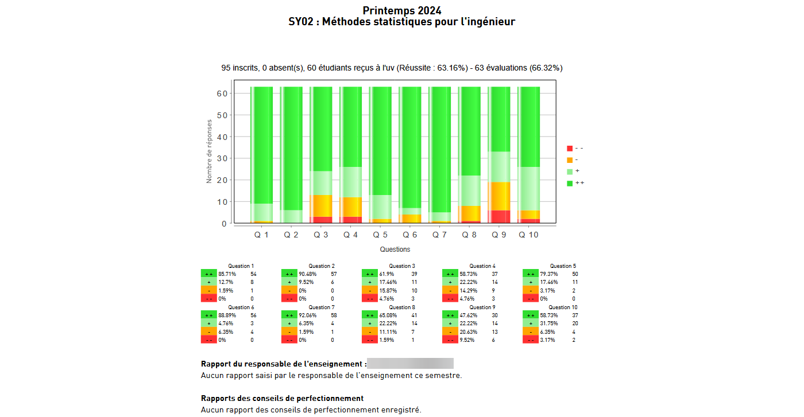
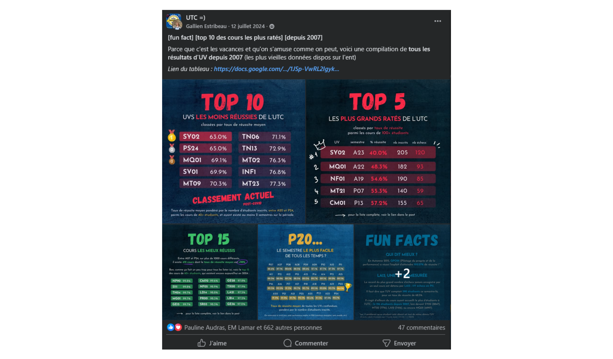

# Analyse des résultats académiques de l'UTC

Mini-projet d'analyse des résultats académiques de l'Université de Technologie de Compiègne (UTC).

Réalisé en quelques jours, par simple curiosité, puis publié sur le réseau social de l'université. 

Excellente réception auprès des étudiants.

Juillet 2024.

## Contexte

Pour chaque semestre, les résultats académiques de l'UTC sont compilés dans un fichier pdf disponible sur l'intranet de l'université. Ce fichier contient une page par cours, avec les résultats compilés (nombre d'inscrits, taux de réussite, nombre d'absent), l'évaluation du cours par les étudiants (clarté du cours, qualité des supports pédagogiques, etc), et parfois des commentaires libres des professeurs. 

Voici un exemple de page de résultats pour un cours donné :

Néanmoins, aucune statistique n'est publiée sur ces données : taux de réussite moyen d'un cours sur plusieurs semestres, évolution des taux de réussite dans le temps, etc. 

Notre objectif va donc être de réaliser nous-mêmes ces statistiques, à partir des fichiers pdf disponibles.

## Méthodologie

1. Chaque fichier pdf est téléchargé manuellement (un par semestre entre 2007 et 2024) dans le dossier `data-raw/`, chacun contenant environ 300 pages, pour un total de 35 fichiers. Total : 700Mo. S'il y avait eu plus de fichiers, une automatisation du téléchargement aurait été envisagée, mais ici cela n'en valait pas la peine.
2. Une première étape d'extraction a été réalisée manuellement, dans `1 - extraction.ipynb`, pour comprendre la structure des fichiers pdf et essayer différentes outils. Méthode retenue : extraction avec la libraire `PyPDF2`, puis stockage des données extraites au format .json.
3. Automatisation de l'extraction dans `2 - extraction auto.py`, générant un fichier .json par semestre dans le dossier `data-clean/`.
4. Analyse des données extraites dans `3 - analyse.ipynb`, avec visualisations.
5. Réalisation de visuels intéressants à partir des données analysées, avec Canva.
6. Publication des visuels sur le réseau social étudiant de l'université

## Organisation du dépôt 

- `assets` : images du readme 
- `data-raw` : fichiers pdf originaux téléchargés depuis l'intranet de l'UTC. En raison de leur taille importante, et pour des raisons de confidentialité, ils ne sont pas synchronisés avec le dépôt GitHub.
- `data-clean` : données extraites au format .json, prêtes à être analysées. Même remarque que pour `data-raw`.
- `outputs` : visuels et tableaux réalisés à partir des données analysées.
- `1 - extraction.ipynb` : notebook contenant les premiers essais d'extraction des données depuis les fichiers pdf bruts, en vue de l'automatisation.
- `2 - extraction auto.py` : script python d'extraction automatisée des données pour un fichier pdf donné.
- `3 - analyse.ipynb` : notebook d'analyse des données extraites, avec visualisations.

## Résultats

Voici les visuels réalisés à partir des données analysées :

Ces visuels ont alors été partagés avec les étudiants de l'UTC qui ont beaucoup apprécié l'initiative, comme en témoignent les nombreuses réactions. 

Voici le post Facebook réalisé pour l'occasion :

  

## Prochaines étapes

- Mettre à jour le projet avec des données récentes
- Automatiser entièrement les tâches : téléchargement des pdf, extraction, analyse, génération des visuels
- Publier les résultats sur un site web dynamique
- Bonus : utiliser les notes attribués aux cours par les élèves pour faire des analyses croisées (corrélation entre la qualité perçue et le taux de réussite, etc)